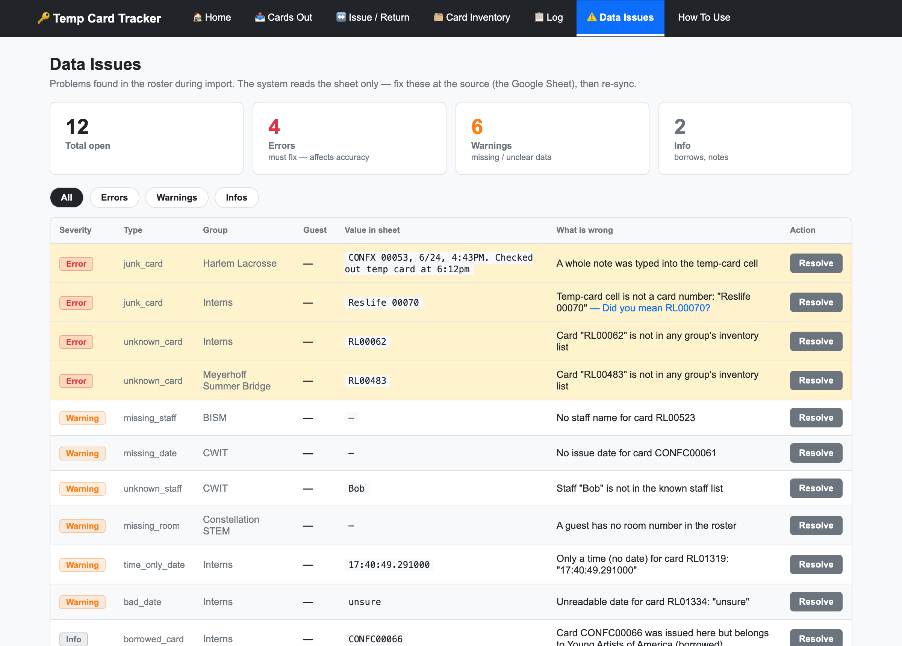
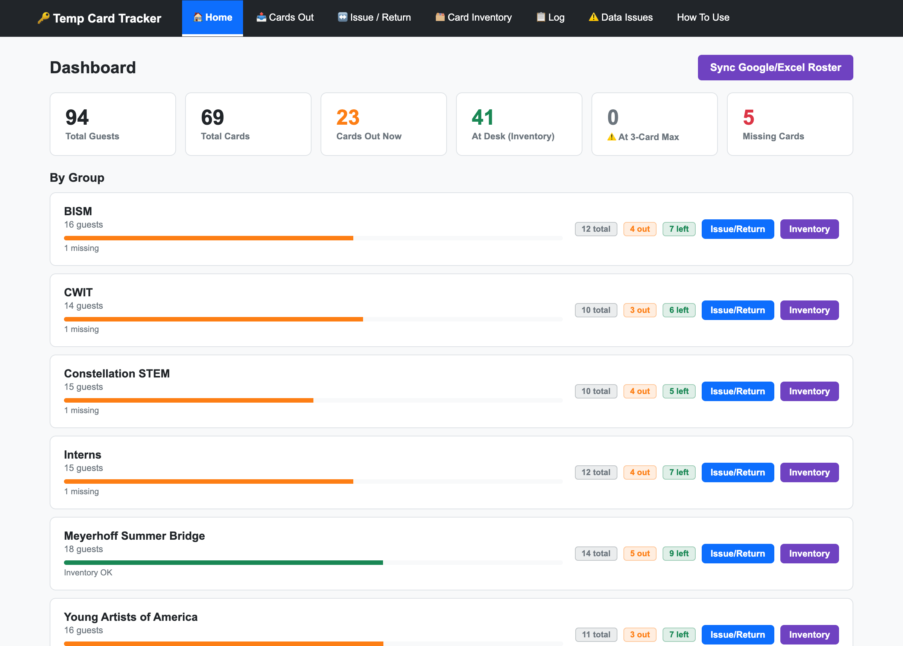
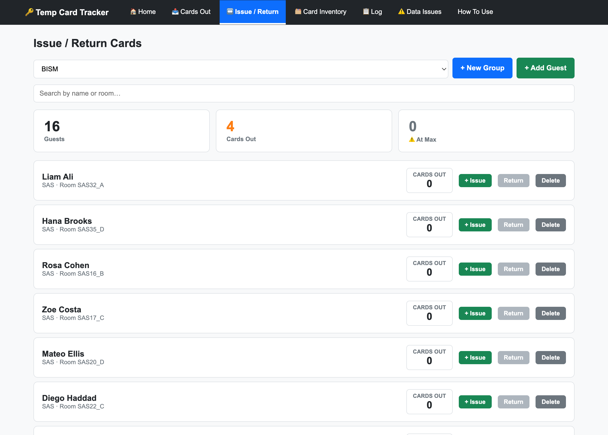
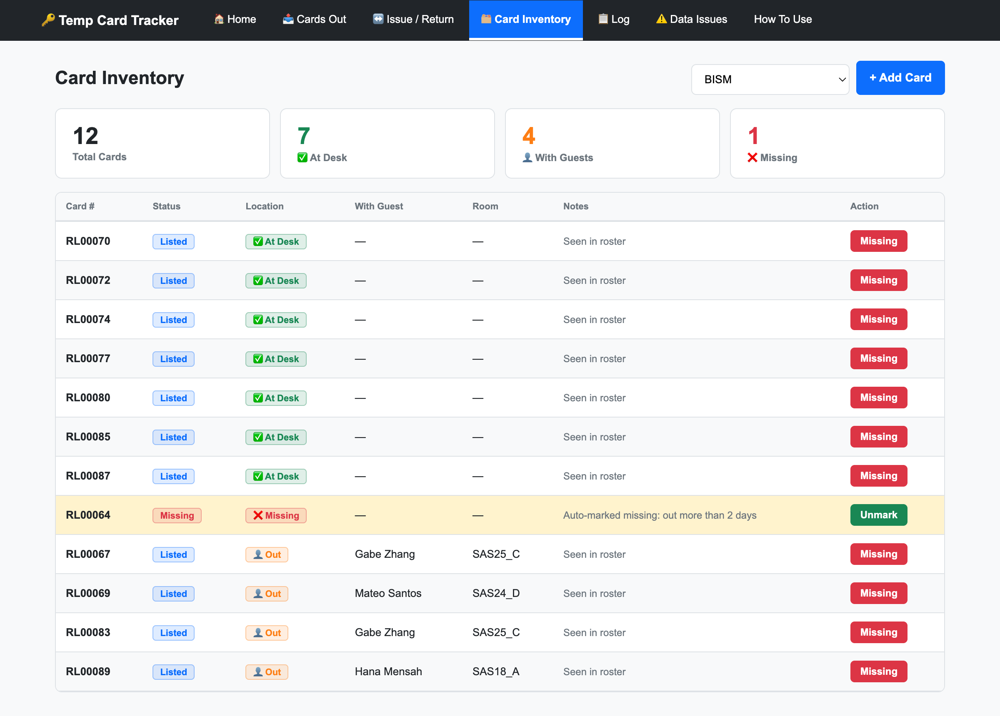
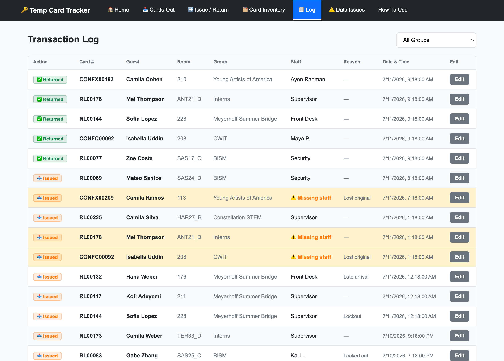

# Temp Card Tracker (Prototype)

A single web app that replaces juggling multiple Google Sheets for temporary
room-access key cards. Shows every conference/group, every card, who has what,
a full transaction log, and a **Data Issues** report that flags bad/missing
roster data. Issue/return with a 3-card-per-guest limit, borrow-across-groups,
and missing-card tracking.

**Stack:** React (single file, no build step) + Express + **SQLite built into
Node** (`node:sqlite`) + **SheetJS** for reading rosters. No database server, no
native compilation.

## Screenshots

> All data shown is synthetic (random example guests, placeholder staff).

**Data Issues — the roster quality report.** Because staff type free text into a
shared spreadsheet, the importer classifies every cell and flags what's wrong
before it can cause a billing mistake:



| Home dashboard | Issue / Return |
|---|---|
|  |  |

| Card Inventory | Transaction Log |
|---|---|
|  |  |

## What this demonstrates

- **Full-stack build** — a React single-page UI, an Express REST API, and a
  normalized relational schema (foreign keys, indexes, a trigger, and
  transaction-wrapped writes) on SQLite.
- **Data engineering / ETL** — a one-way pipeline (**extract → classify →
  validate → load**) that turns a messy multi-tab spreadsheet into clean,
  queryable data without ever writing back to the source.
- **Messy-text resolution** — a reference-set classifier that, because every cell
  is the same type (text), resolves each value by priority: known staff (fuzzy
  token match) → known card (inventory) → date (many broken formats like
  `6/19 - 7:17PM`, `unsure`, time-only) → else reason. Junk like `Reslife 00070`
  or a note pasted into a card cell is detected and flagged, not trusted.
- **Data quality as a feature** — every anomaly (missing dates, unknown cards,
  name mismatches, duplicates) becomes a severity-ranked report so errors are
  fixed at the source before they affect accuracy.
- **Idempotent sync** — re-running the import preserves edits made in the app
  (`edited_in_app`), so corrections are never clobbered.
- **Privacy by design** — synthetic demo data, secrets in a gitignored `.env`,
  read-only access to the source, and (planned) a fully self-contained build with
  no external calls for a dataset that can include minors.
- **Low-friction stack** — Node's built-in SQLite means no database server and no
  native compilation; the UI needs no build step.

## Requirements

- **Node.js ≥ 22.5** (`node --version`).

## Run it

```bash
cd temp-card-tracker
npm install          # Express + SheetJS (pure JS)
npm run seed         # demo data with random example names + sample data issues
npm start            # http://localhost:5000
```

## Tabs

| Tab | What it does |
|---|---|
| **Home** | Totals + a card per group with Issue/Return and Inventory shortcuts |
| **Cards Out** | Every card currently with a guest — who, who issued it, when |
| **Issue / Return** | Pick a group, search a guest, issue/return, add guests/groups |
| **Card Inventory** | Per-group cards with At Desk / Out / Missing; mark missing |
| **Log** | Full audit trail of every issue and return; editable |
| **Data Issues** | Problems found in the roster during import (see below) |
| **How To Use** | Plain-English staff instructions |

## Roster import & data cleaning (one-way)

The importer reads a roster workbook and loads clean data into the app. **It only
ever reads — it never writes back to the sheet.** Your Google Sheet / Excel file
is the source of reference and stays untouched.

```bash
# import a local Excel export (rebuild the DB from it):
npm run import -- "/path/to/Conferences & Interns Master Spreadsheet Summer 2026.xlsx" --reset
```

What it does (`import/`):

1. **Extract** — reads each group's tab read-only (SheetJS).
2. **Parse** — finds guest rows *and* the bottom-section card inventory on each tab.
3. **Classify** (`classify.js`) — because every cell is text, it resolves each
   temp-card cell against reference sets, in order:
   **staff name** (fuzzy match to the known staff list) →
   **card number** (must be in the inventory) →
   **date** (handles messy formats like `6/19 - 7:17PM`, `unsure`, time-only) →
   else **reason / flag**.
4. **Load** — upserts into SQLite, preserving anything edited in the app
   (`edited_in_app`), so a re-sync never clobbers staff corrections.
5. **Report** — writes every problem to the **Data Issues** tab.

### What Data Issues catches

- Junk in a card cell (`Reslife 00070`, or a whole note typed into the cell)
- Card numbers not in any group's inventory (possible typo or missing inventory)
- Missing / unreadable / time-only issue dates
- Missing or unknown staff names
- Guests with no room number
- Cards marked with a note in inventory (e.g. `RL00490(broken)`)
- Borrowed cards (info) and the same card issued to two people at once (error)

Severity: **error** = affects accuracy (fix before charging for lost cards),
**warn** = missing/unclear, **info** = borrows/notes.

## Will importing affect the real data?

No. The importer is **read-only** on the sheet. The local `data/cards.db` is just
a rebuildable cache of whatever the sheet says — delete it and re-import anytime.
When real data arrives, point `npm run import` at the real sheet; nothing from the
demo carries over.

## Roadmap

1. **Live Google Sheet sync** — only step 1 (Extract) changes: fetch the sheet's
   read-only export URL, then the same pipeline runs. Optional auto-refresh.
2. **Secure online hosting (minors' data)** — UMBC-controlled/private server,
   login + roles, audit trail, and vendoring React/SheetJS locally so the browser
   makes zero external calls.

## Files

| File | Role |
|---|---|
| `server.js` | Express API + serves the frontend |
| `db.js` | SQLite connection layer (`node:sqlite`) |
| `schema.sql` | Tables/indexes/triggers, incl. `data_issues` |
| `seed.js` | Reset + load demo data (random names + sample issues) |
| `import/classify.js` | Reference-set cell classifier (unit-tested: `node import/classify.js`) |
| `import/import.js` | One-way roster importer |
| `public/index.html` | Entire React UI (no build step) |
| `data/cards.db` | The SQLite database (created by seed/import) |

## Data & privacy

All names in this repository are **synthetic** (random example guests, placeholder
staff). No real roster, spreadsheet, or personal data is included. Real staff names
are supplied at runtime via a gitignored `.env` (`CA_STAFF_NAMES`); the roster
workbook is never committed. The importer is read-only and the local SQLite
database (`data/`) is gitignored.
